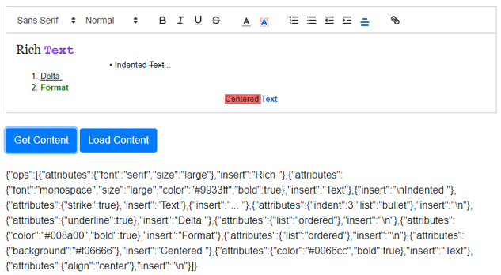
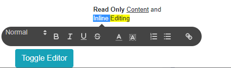
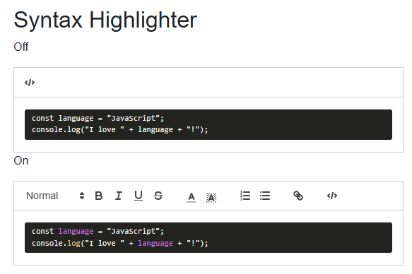

# Blazored TextEditor

<!--  -->

[](https://dotnet.microsoft.com/en-us/apps/aspnet/web-apps/blazor) [](https://learn.microsoft.com/en-us/dotnet/csharp/)

[](https://github.com/Blazored/TextEditor/actions/workflows/ci-main.yml)
[](https://github.com/Blazored/TextEditor/actions/workflows/ci-pr.yml)
[](https://github.com/Blazored/TextEditor/actions/workflows/codeql-analysis.yml)
[](https://github.com/Blazored/TextEditor/actions/workflows/release-drafter.yml)

> Rich Text Editor for Blazor applications - Uses [Quill JS](https://quilljs.com/ "Quill JS.com")


## Sample Applications

* [Simple blogging application written in Microsoft Server Side Blazor](https://github.com/ADefWebserver/Blazor-Blogs "Blazor Blogs") - [Contains an example of uploading images]

## Helpful Articles

* [Creating Reusable Custom Blazor Controls](https://blazorhelpwebsite.com/ViewBlogPost/11 "BlazorHelpWebsite.com")
* [Creating A Rich Text Editor In Blazor Using Quill](https://blazorhelpwebsite.com/ViewBlogPost/12 "BlazorHelpWebsite.com")

## Installing

You can install from NuGet using the following command:

`Install-Package Blazored.TextEditor`

Or via the Visual Studio package manger.

## Setup

Blazor Server applications will need to include the following CSS and JS files in their `Pages\_Host.cshtml` (or `Pages/_Layout.cshtml` if using .Net 6).

In the `head` tag add the following CSS.

```html
    <link href="https://cdn.jsdelivr.net/npm/quill@2.0.3/dist/quill.snow.css" rel="stylesheet">
    <link href="https://cdn.jsdelivr.net/npm/quill@2.0.3/dist/quill.bubble.css" rel="stylesheet">
```

Then add the JS script at the bottom of the page using the following script tag.

```html
    <script src="https://cdn.jsdelivr.net/npm/quill@2.0.3/dist/quill.js"></script>
    <script src="_content/Blazored.TextEditor/quill-blot-formatter.min.js"></script>
    <script src="_content/Blazored.TextEditor/Blazored-BlazorQuill.js"></script>
```

**NOTE** If you're using Blazor WebAssembly then these need to be added to your `wwwroot\index.html`.

You can add the following using statement to your main `_Imports.razor` to make referencing the component a bit easier.

```cs
@using Blazored.TextEditor
```

## Usage

Below is a list of all the options available on the Text Editor.

**Templates**

- `ToolbarContent` (optional) - Allows the user to define the Toolbar (above the editor control, or in-line when using the bubble theme, and a user highlights text in the editor).
- `EditorContent` (optional) - Allows the user to define the initial content

**Parameters**

- `ReadOnly` (Optional - Default: `false`) - Determines if the editor will load in read-only mode. This mode can be toggled.
- `Placeholder` (Optional - Default: `Compose an epic...`) - The text to show when editor is empty.
- `Theme` (Optional - Default: `snow`) - Use `snow` to show the Toolbar on top of the editor, and `bubble` for inline editing.
- `DebugLevel` (Optional - Default: `info`) - Determines the level of debug information returned to the web browser console window. Options are `error`, `warn`, `log`, or `info`.
- `Syntax` (Optional - Default: `false`) - The Syntax Module enhances the Code Block format by automatically detecting and applying syntax highlighting.

**Methods**

- `GetText` - Gets the content of the editor as Text.
- `GetHTML` - Gets the content of the editor as HTML.
- `GetContent` - Gets the content of the editor in the native Quill JSON Delta format.
- `LoadContent` (`json`) - Allows the content of the editor to be programmatically set.
- `LoadHTMLContent` (`string`) - Allows the content of the editor to be programmatically set.
- `InsertImage` (`string`) - Inserts an image at the current point in the editor.
- `InsertText` (`string`) - Inserts text at the current point in the editor.

## Basic Example

(see code in the [`Index.razor` page](https://github.com/Blazored/TextEditor/blob/main/samples/BlazorServerSide/Pages/Index.razor) in the repo for more examples)

<details>
<summary>Code</summary>

```cs
@using Blazored.TextEditor

<BlazoredTextEditor @ref="@QuillHtml">
    <ToolbarContent>
        <select class="ql-header">
            <option selected=""></option>
            <option value="1"></option>
            <option value="2"></option>
            <option value="3"></option>
            <option value="4"></option>
            <option value="5"></option>
        </select>
        <span class="ql-formats">
            <button class="ql-bold"></button>
            <button class="ql-italic"></button>
            <button class="ql-underline"></button>
            <button class="ql-strike"></button>
        </span>
        <span class="ql-formats">
            <select class="ql-color"></select>
            <select class="ql-background"></select>
        </span>
        <span class="ql-formats">
            <button class="ql-list" value="ordered"></button>
            <button class="ql-list" value="bullet"></button>
        </span>
        <span class="ql-formats">
            <button class="ql-link"></button>
        </span>
    </ToolbarContent>
    <EditorContent>
        <h4>This Toolbar works with HTML</h4>
        <a href="http://BlazorHelpWebsite.com">
        BlazorHelpWebsite.com</a>
    </EditorContent>
</BlazoredTextEditor>
<br />
<button class="btn btn-primary" 
        @onclick="GetHTML">Get HTML</button>
<button class="btn btn-primary"
        @onclick="SetHTML">Set HTML</button>
<br />
<div>
    <br />
    @((MarkupString)QuillHTMLContent)
    @QuillHTMLContent
</div>
<br />

@code {

BlazoredTextEditor QuillHtml;
string QuillHTMLContent;

    public async Task GetHTML()
    {
        QuillHTMLContent = await this.QuillHtml.GetHTML();
    }

    public async Task SetHTML()
    {
        string QuillContent =
            @"<a href='http://BlazorHelpWebsite.com/'>" +
            "</a>";

        await this.QuillHtml.LoadHTMLContent(QuillContent);
    }
}
```

</details>

### Alternative Using of the BlazoredTextEditor Component

Depending on our use case, we may want to add some styling to the _Toolbar_ or _Editor_. We can also place the _Toolbar_ below the _Editor_ by setting the `BottomToolbar` property to `"true"` in the **BlazoredTextEditor** component:

<details>
<summary>Code</summary>

```csharp
<style>
    .rounded {
        border-radius: 8px;
    }
    .colored-border {
        border: 4px solid red !important;
    }
</style>

<h1>Blazored.TextEditor Usage Examples</h1>

<h3>Basic Example</h3>
<BlazoredTextEditor
    @ref="@richEditor">
    <ToolbarContent>
        @((MarkupString) toolbar)
    </ToolbarContent>
    <EditorContent>
        @((MarkupString) body)
    </EditorContent>
</BlazoredTextEditor>
<br/>
<br/>

<h3>Show the Toolbar Below the Editor</h3>
<BlazoredTextEditor
    BottomToolbar="true"
    @ref="@richEditor">
    <ToolbarContent>
        @((MarkupString) toolbar)
    </ToolbarContent>
    <EditorContent>
        @((MarkupString) body)
    </EditorContent>
</BlazoredTextEditor>
<br/>
<br/>

<h3>Styled Toolbar</h3>
<BlazoredTextEditor
    @ref="@richEditor"
    ToolbarCSSClass="rounded colored-border"
    ToolbarCssStyle="background: lightpink">
    <ToolbarContent>
        @((MarkupString) toolbar)
    </ToolbarContent>
    <EditorContent>
        @((MarkupString) body)
    </EditorContent>
</BlazoredTextEditor>
<br/>
<br/>

<h3>Styled Editor</h3>
<BlazoredTextEditor
    EditorCSSClass="rounded colored-border"
    EditorCssStyle="padding: 10px; background: lightpink"
    @ref="@richEditor">
    <ToolbarContent>
        @((MarkupString) toolbar)
    </ToolbarContent>
    <EditorContent>
        @((MarkupString) body)
    </EditorContent>
</BlazoredTextEditor>

@code
{
    BlazoredTextEditor richEditor = default!;
    string toolbar = """"...markup here..."""";
    string body = """"...markup here..."""";

    protected override void OnInitialized()
    {
        toolbar = """"
            <select class="ql-header">
                <option selected=""></option>
                <option value="1"></option>
                <option value="2"></option>
                <option value="3"></option>
                <option value="4"></option>
                <option value="5"></option>
            </select>
            <span class="ql-formats">
                <button class="ql-bold"></button>
                <button class="ql-italic"></button>
                <button class="ql-underline"></button>
                <button class="ql-strike"></button>
            </span>
            <span class="ql-formats">
                <select class="ql-color"></select>
                <select class="ql-background"></select>
            </span>
            <span class="ql-formats">
                <button class="ql-list" value="ordered"></button>
                <button class="ql-list" value="bullet"></button>
            </span>
            <span class="ql-formats">
                <button class="ql-link"></button>
            </span>
            """";

        body = """"
            <h4>This Toolbar works with HTML</h4>
            <a href="https://BlazorHelpWebsite.com">BlazorHelpWebsite.com</a>
            """";
    }
}
```

</details>

## Screenshots


### Rich Text Screenshot



### Read Only Screenshot



## Adding Syntax Highlighting

See [Syntax Highlighter Example](docs/SyntaxHighlighterExample.md) docs for more information.



---

# Blazored TextEditor Forks

* [WYSIWYGTextEditor](https://github.com/somegenericdev/WYSIWYGTextEditor)

